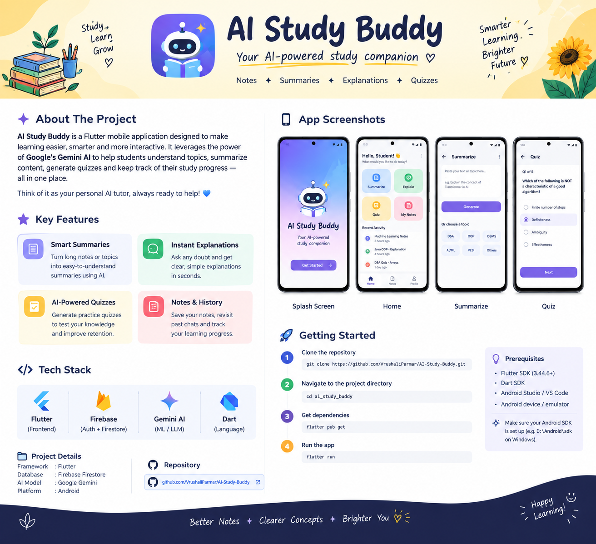

# 🤖 AI Study Buddy

<p align="center">
  
</p>

<p align="center">
  <strong>Your AI-powered study companion for smarter, simpler and more interactive learning.</strong>
</p>

<p align="center">
  <a href="https://github.com/VrushaliParmar/AI-Study-Buddy">
    
  </a>
  
  
  
  
</p>

---

## 🌟 About The Project

**AI Study Buddy** is an AI-powered Flutter mobile application designed to make studying more **personalized, interactive and efficient**.

Instead of switching between multiple tools to summarize notes, understand difficult concepts, create practice questions and manage study material, AI Study Buddy brings these capabilities together in one application.

The application uses **Google Gemini AI** to help students:

* 📚 Understand difficult concepts
* ✨ Generate concise summaries
* 🧠 Create AI-powered quizzes
* 📝 Manage and revisit study notes
* 💬 Get simple explanations for complex topics
* 📊 Keep track of learning activity

> **Think of AI Study Buddy as your personal AI tutor — available whenever you need help learning.**

---

## 🎯 Problem Statement

Students often use different applications for:

* Taking notes
* Searching for explanations
* Summarizing study material
* Creating practice questions
* Revising previous topics

This creates unnecessary switching between platforms and makes studying less organized.

### 💡 Our Solution

AI Study Buddy combines these learning activities into a single mobile application powered by AI.

```text
              STUDY MATERIAL
                    │
                    ▼
             ┌──────────────┐
             │ AI Study     │
             │    Buddy     │
             └──────┬───────┘
                    │
        ┌───────────┼───────────┐
        ▼           ▼           ▼
   Summarize    Explain      Generate
                            Quizzes
        │           │           │
        └───────────┼───────────┘
                    ▼
             BETTER LEARNING
```

---

# ✨ Key Features

<table>
<tr>
<td width="50%">

### 📚 Smart Summarization

Convert lengthy study material into concise, easy-to-understand summaries using AI.

</td>

<td width="50%">

### 💡 Instant Explanations

Ask questions about difficult concepts and receive simple, student-friendly explanations.

</td>
</tr>

<tr>
<td width="50%">

### 🧠 AI Quiz Generation

Generate practice questions from study material to test understanding and improve retention.

</td>

<td width="50%">

### 📝 Smart Notes

Create, save and revisit important study notes in one place.

</td>
</tr>

<tr>
<td width="50%">

### 🕐 Learning History

Keep track of previously generated summaries, explanations and learning activities.

</td>

<td width="50%">

### 🎓 Student-Focused Experience

Designed around common student workflows rather than generic AI chat.

</td>
</tr>
</table>

---

# 📱 App Preview

<p align="center">
  
  &nbsp;&nbsp;
  
  &nbsp;&nbsp;
  
  &nbsp;&nbsp;
  
</p>

<p align="center">
  <i>AI Study Buddy — from notes to understanding.</i>
</p>

> 📌 **Add your actual screenshots inside the `screenshots/` folder.**

---

# 🛠️ Tech Stack

| Technology                   | Purpose                                        |
| ---------------------------- | ---------------------------------------------- |
| **Flutter**                  | Cross-platform mobile application development  |
| **Dart**                     | Application programming language               |
| **Firebase Authentication**  | User authentication                            |
| **Cloud Firestore**          | Storing notes, history and user data           |
| **Google Gemini AI**         | AI-powered summaries, explanations and quizzes |
| **Android Studio / VS Code** | Development environment                        |
| **Git & GitHub**             | Version control and project hosting            |

---

# 🏗️ Application Architecture

```text
                    ┌─────────────────────┐
                    │      Flutter UI     │
                    │                     │
                    │ Home │ Notes │ Quiz │
                    └──────────┬──────────┘
                               │
                               ▼
                    ┌─────────────────────┐
                    │  Application Logic  │
                    │                     │
                    │ Input Processing    │
                    │ AI Requests         │
                    │ State Management    │
                    └──────────┬──────────┘
                               │
                 ┌─────────────┴─────────────┐
                 │                           │
                 ▼                           ▼
        ┌─────────────────┐        ┌─────────────────┐
        │   Gemini AI     │        │    Firebase     │
        │                 │        │                 │
        │ Summarization   │        │ Authentication  │
        │ Explanation     │        │ Firestore       │
        │ Quiz Generation │        │ User Data       │
        └─────────────────┘        └─────────────────┘
```

---

# 🚀 Getting Started

Follow these steps to run the project locally.

## 1️⃣ Prerequisites

Make sure you have the following installed:

* [Flutter SDK](https://docs.flutter.dev/get-started/install)
* Dart SDK
* Android Studio or VS Code
* Android SDK
* Android Emulator or physical Android device
* Git

Check your Flutter installation:

```bash
flutter doctor
```

---

## 2️⃣ Clone the Repository

```bash
git clone https://github.com/VrushaliParmar/AI-Study-Buddy.git
```

Move into the project directory:

```bash
cd AI-Study-Buddy
```

---

## 3️⃣ Install Dependencies

```bash
flutter pub get
```

---

## 4️⃣ Configure Firebase

Connect the application to your Firebase project and make sure the required Firebase configuration files are present.

For Android, this typically includes:

```text
android/
└── app/
    └── google-services.json
```

> ⚠️ Do not commit private API keys, credentials or sensitive configuration files to GitHub.

---

## 5️⃣ Configure Gemini AI

Add your Gemini API configuration according to the project's implementation.

For security, avoid hardcoding API keys directly inside source code.

```text
API Key
   │
   ▼
Secure Configuration
   │
   ▼
Gemini API
   │
   ▼
AI Response
```

---

## 6️⃣ Run the Application

Connect an Android device or start an emulator and run:

```bash
flutter run
```

---

# 📂 Project Structure

```text
ai_study_buddy/
│
├── android/
├── ios/
├── lib/
│   │
│   ├── main.dart
│   │
│   ├── screens/
│   │   ├── home/
│   │   ├── notes/
│   │   ├── summarize/
│   │   ├── explain/
│   │   └── quiz/
│   │
│   ├── services/
│   │   ├── firebase_service.dart
│   │   └── gemini_service.dart
│   │
│   ├── models/
│   │
│   ├── widgets/
│   │
│   └── utils/
│
├── assets/
│   └── banner.png
│
├── screenshots/
│   ├── splash.png
│   ├── home.png
│   ├── summarize.png
│   └── quiz.png
│
├── pubspec.yaml
└── README.md
```

> Adjust the folder structure above if your actual project structure is different.

---

# 🔄 How It Works

### 1. 👤 User provides study material

The student enters a topic, question or study content.

### 2. ⚙️ Application processes the request

Flutter handles the user interaction and sends the request to the appropriate service.

### 3. 🤖 Gemini AI generates the response

The AI processes the content according to the requested action.

### 4. 📖 Student learns

The result is presented in a simple and readable format.

### 5. 💾 Important content can be saved

Notes and learning activity can be stored using Firebase.

```text
Student
   │
   ▼
Enter Topic / Notes
   │
   ▼
Choose Action
   │
   ├──► Summarize
   │
   ├──► Explain
   │
   └──► Generate Quiz
            │
            ▼
        Gemini AI
            │
            ▼
       AI Response
            │
            ▼
       Learn / Save
```

---

# 🎓 Example Use Cases

### 📖 Before an Exam

Paste lengthy study material → generate a concise summary → revise important points.

### 🧠 Difficult Concept

Enter:

```text
Explain Transformer architecture in simple terms.
```

AI Study Buddy generates a student-friendly explanation.

### 📝 Practice

Choose a topic → generate an AI quiz → answer questions → identify areas that need revision.

### 📚 Personal Notes

Save important explanations and notes so they can be revisited later.

---

# 🔐 Security Considerations

The project is designed with basic security practices in mind:

* 🔒 Avoid exposing API keys in source code
* 🔑 Use Firebase Authentication for user access
* 🗄️ Use Firestore security rules for database access
* 🚫 Do not commit `.env` files or secret credentials
* 🛡️ Restrict database access to authenticated users where appropriate

---

# 🧪 Future Improvements

AI Study Buddy can be extended with:

* 🎙️ Voice-based AI interaction
* 📄 PDF/document summarization
* 📷 OCR-based handwritten note scanning
* 📊 Personalized learning analytics
* 🔔 Study reminders
* 🗓️ AI-generated study schedules
* 🧠 Adaptive quizzes based on performance
* 🌐 Multi-language learning support
* 📴 Offline notes and revision mode
* 🎯 Personalized learning recommendations

---

# 📈 Future Vision

The long-term goal is to evolve AI Study Buddy from a simple AI utility into a **personalized learning assistant**.

```text
          AI Study Buddy
                │
        ┌───────┼────────┐
        ▼       ▼        ▼
      Learn   Practice   Track
        │       │        │
        └───────┼────────┘
                ▼
       Personalized Learning
                │
                ▼
         Better Understanding
```

---

# 💻 Development Environment

```text
Framework     : Flutter
Language      : Dart
AI Model      : Google Gemini
Backend       : Firebase
Database      : Cloud Firestore
Platform      : Android
IDE           : VS Code / Android Studio
Version       : Flutter 3.44.6+
```

---

# 📌 Project Status

🚧 **Currently in Development**

The project is being actively developed with the goal of creating a practical AI-powered study companion for students.

---

# 🤝 Contributing

Contributions, ideas and feedback are welcome!

If you would like to contribute:

```bash
# Fork the repository

# Create your feature branch
git checkout -b feature/your-feature

# Commit your changes
git commit -m "Add: your feature"

# Push the branch
git push origin feature/your-feature
```

Then open a Pull Request.

---

# ⭐ Support the Project

If you find **AI Study Buddy** useful or interesting:

⭐ Star the repository
🍴 Fork the project
💡 Share your ideas
🐛 Report issues
🤝 Contribute

Every contribution helps improve the project!

---

# 👩‍💻 Developer

<p align="center">

### Vrushali Parmar

**Electronics & Telecommunication Engineering Student**
**AI/ML • VLSI • Software Development**

<a href="https://github.com/VrushaliParmar">

</a>

<a href="https://www.linkedin.com/in/vrushali-parmar-259669397/">

</a>

</p>

---

<p align="center">

### 🌻 Study Smarter. Understand Better. Build More.

**AI Study Buddy — Your AI-powered study companion.**

⭐ If you like this project, consider giving it a star!

</p>
